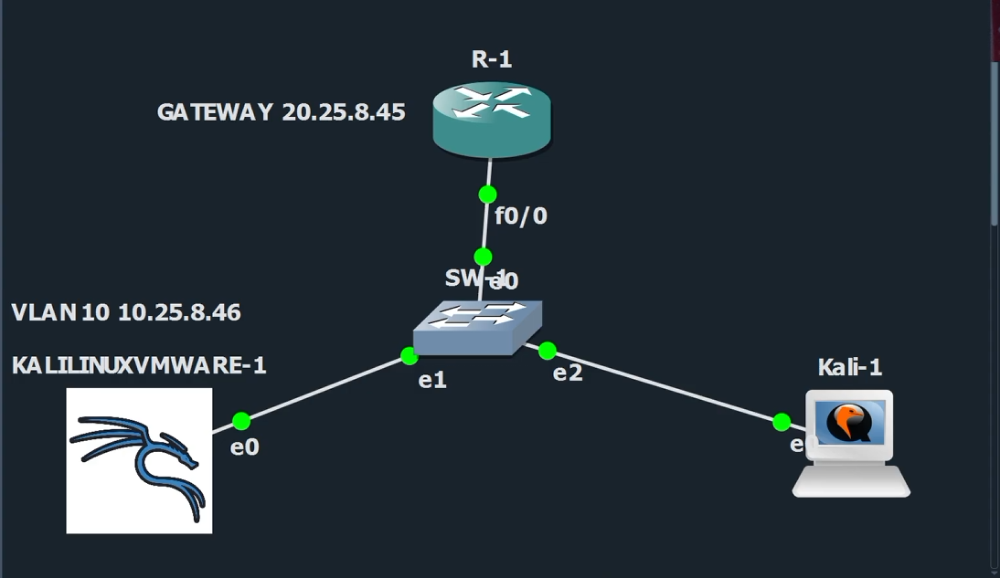
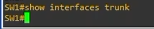
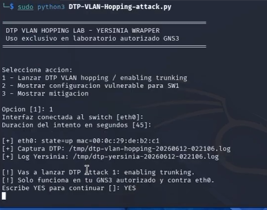
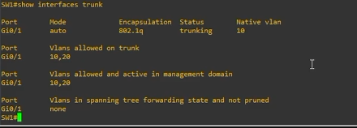
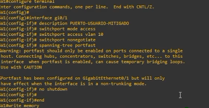
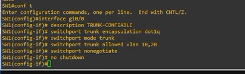
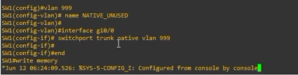

# How-To: DTP VLAN Hopping - convertir interfaz de acceso en trunk


Este repositorio documenta un laboratorio controlado en GNS3 donde se demuestra un ataque **DTP VLAN Hopping**. El objetivo es convertir una interfaz configurada inicialmente como puerto de acceso en una interfaz troncal usando negociación DTP.

> Uso exclusivo en laboratorio autorizado. No ejecutar en redes reales, empresariales o de terceros.

## 1. Topología utilizada



**Resumen de la red:**

| Equipo | Rol | Interfaz | Dirección / VLAN |
|---|---|---|---|
| R-1 | Gateway | Fa0/0 | 20.25.8.45/24 |
| SW1 | Switch vulnerable | Gi0/0, Gi0/1, Gi0/2 | VLAN 10 y VLAN 20 |
| Kali Linux VMware | Atacante | eth0 -> SW1 Gi0/1 | VLAN 10 / 10.25.8.46 |
| Kali-1 / PC víctima | Host de prueba | SW1 Gi0/2 | VLAN 20 |

## 2. Requisitos

- GNS3 con router Cisco y switch IOSvL2.
- Kali Linux conectado directamente al switch por `eth0`.
- Python 3.
- Yersinia.
- tcpdump.
- Permisos de superusuario.

Instalación en Kali:

```bash
sudo apt update
sudo apt install -y yersinia tcpdump python3
```

## 3. Configurar el puerto vulnerable en SW1

El ataque requiere que el puerto conectado a Kali permita negociación DTP. En este laboratorio se usó `dynamic auto`:

```cisco
configure terminal
vlan 10
 name KALI
vlan 20
 name PRODUCCION
interface gi0/1
 description KALI-DTP-VULNERABLE
 switchport trunk encapsulation dot1q
 switchport mode dynamic auto
 switchport access vlan 10
 switchport trunk native vlan 10
 switchport trunk allowed vlan 10,20
 no shutdown
end
write memory
```

Validación antes del ataque:

```cisco
show interfaces trunk
show interfaces gi0/1 switchport
show dtp interface gi0/1
```

Evidencia inicial:



## 4. Ejecutar el script

Desde Kali:

```bash
sudo python3 DTP-VLAN-Hopping-attack.py
```

Parámetros usados en la prueba:

```text
Opcion: 1
Interfaz conectada al switch: eth0
Duracion del intento en segundos: 45
Confirmacion: YES
```

Evidencia de ejecución:



## 5. Verificar el resultado del ataque

En SW1:

```cisco
show interfaces trunk
```

Resultado esperado: `Gi0/1` aparece en estado `trunking` y permite VLAN 10 y VLAN 20.



## 6. Aplicar contramedida en puertos de usuario

Los puertos de usuario no deben negociar trunks. La mitigación consiste en forzar modo acceso, asignar una VLAN específica y desactivar DTP con `switchport nonegotiate`.

```cisco
configure terminal
interface gi0/1
 description PUERTO-USUARIO-MITIGADO
 switchport mode access
 switchport access vlan 10
 switchport nonegotiate
 spanning-tree portfast
 no shutdown
end
write memory
```

Evidencia:



## 7. Configurar trunks confiables de forma explícita

Los enlaces que sí deben ser trunk se configuran manualmente y con DTP deshabilitado:

```cisco
configure terminal
interface gi0/0
 description TRUNK-CONFIABLE
 switchport trunk encapsulation dot1q
 switchport mode trunk
 switchport trunk allowed vlan 10,20
 switchport nonegotiate
 no shutdown
end
write memory
```



## 8. Usar VLAN nativa no utilizada

Para reducir riesgos de VLAN hopping, se recomienda usar una VLAN nativa no usada por usuarios:

```cisco
configure terminal
vlan 999
 name NATIVE_UNUSED
interface gi0/0
 switchport trunk native vlan 999
end
write memory
```



## 9. Enlaces

- Repositorio: https://github.com/iClexi/DTP-VLAN-Hopping
- Playlist de YouTube: https://youtube.com/playlist?list=PLTp8NH1NHehxblNDD-ApWYQsKbfWJVFmf&si=vD3gJYk3grB9q30f
- Link de Youtube: https://www.youtube.com/watch?v=CTbAkY9fn70

## 10. Autor

- Michael David Robles Fermín
- Matrícula: 2025-0845
- Asignatura: Seguridad de Redes
